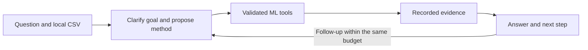

# LLM Tool Calling Lab

An experimental local chatbot that chooses and compares ML tools, shows its evidence, and lets developers replace its components.

Ask a question about a numerical table. The assistant clarifies the goal, calls an eligible specialist, records its results, and answers follow-ups using the same evidence and budget. This is a reference implementation for developers, not a promise of general reasoning or automatic domain expertise.

**Status:** `v0.1.0`, experimental. [Get the release](https://github.com/Dolvido/llm-tool-calling-lab/releases/tag/v0.1.0) or read [the results](RESULTS.md). All four families were exercised live. Across 96 supported held-out conversations, the generic chatbot passed 33/48 and structured orchestration passed 31/48 under unblinded AI review. Anomaly conversations were particularly unreliable: 5/24 passed. This experiment did not show a completion benefit from the added planning instructions.

## Inspect the experiment

**Research question:** Does adding structured planning instructions improve grounded completion over a generic tool-calling chatbot with the same local model, tools, data and limits? The intervention is a prompt addition, not a trained planner. Both arms already receive safety, evidence and follow-up instructions.

Start with [RESULTS.md](RESULTS.md) for outcomes and failures, then [EVALUATION.md](EVALUATION.md) for controls and scoring. Inspect [the detailed report](results/v0.1.0/REPORT.md), [diagnostic tables](results/v0.1.0/AGGREGATE.md), and [verification receipt](results/v0.1.0/verification.json). The [case study](docs/CASE_STUDY.md) connects the evidence to proposed engineering choices. [The results evidence map](RESULTS.md#inspect-the-evidence) explains how to reach raw records in the release archive; `.lab/` paths are local working paths, absent from a Git checkout.

The evaluation unit is a two-turn episode; the dataset-level comparison has 24 synthetic held-out datasets with two repeats per arm. Repeats reuse sampling seed 0 and temperature 0. Fixed specialist runs are separate model-quality references. Completion combines structural validation with unblinded implementation-agent AI judgments; it is not a human study or a significance test.

## Supported work

| Task | Methods | Evidence available to the chatbot |
|---|---|---|
| Numerical prediction | Ridge; Random Forest regression | Validation MAE; constant baseline |
| Binary category prediction | Logistic Regression; Random Forest classification | Validation balanced accuracy; confusion counts |
| Unusual-row ranking | Isolation Forest; Local Outlier Factor in novelty mode | New-batch ranking, distribution, agreement |
| Exploratory grouping | K-Means; Gaussian Mixture | Common validation silhouette; group counts |

All four executors and their two methods were verified. Supervised and clustering examples return validation-row predictions; separate fresh-batch scoring is currently available for anomaly detection. The [release status](RELEASE_STATUS.md) records installation, live demonstrations, evaluation, and integrity checks. Forecasting, causal estimation, raw text/images/audio, optimization, and arbitrary generated code are outside v0.1.

## Quickstart — Windows and Python 3.12

Install Python 3.12 and [Ollama](https://ollama.com/download/windows). The tested model is `qwen3:14b-q4_K_M`; its weights are obtained separately. The development machine has an RTX 5080 with 16 GB VRAM and approximately 32 GB RAM. This is a tested configuration, not an established minimum.

```powershell
git clone https://github.com/Dolvido/llm-tool-calling-lab.git
cd llm-tool-calling-lab
py -3.12 -m venv .venv
.\.venv\Scripts\python.exe -m pip install -r requirements.lock
.\.venv\Scripts\python.exe -m pip install --no-deps -e .
ollama pull qwen3:14b-q4_K_M
.\.venv\Scripts\lab.exe doctor
.\.venv\Scripts\lab.exe chat
```

Open `http://127.0.0.1:8501`. Choose an example, select **Start new episode**, then **Try the example question**. Follow up with: “Run the other eligible method, compare the evidence, and explain which result you would use.”

If `py` is unavailable, use the absolute path to Python 3.12 for the first command. `doctor` checks availability; it does not claim live verification. Keep Ollama running during conversations and evaluation.

Upload UTF-8 CSV up to 10 MB, with 100–10,000 fitting/reference rows and 2–30 numerical features. State the target for prediction. Anomaly detection needs a separate batch of 1–10,000 rows. Row IDs are zero-based strings. Feature gaps are median-imputed on training data only. Missing targets, infinities, and entirely missing feature columns are rejected. These are enforced input limits, not a performance guarantee for every table at the maximum size.

## Architecture and limits



The LLM chooses from a catalog. The executor owns preprocessing, splits, fitting, timeouts, and artifacts. Test labels and evaluator scores stay out of chat tools. Evidence panels render stored numbers directly; interpretation is separately reviewed. The coordinator is the same LLM with a structured workflow prompt; v0.1 has no trained routing model or architecture search. No model-generated code executes.

Each episode allows two fits, eight tool calls, six LLM responses, one repair, 4,096 generated tokens, and 180 seconds of system work. Follow-ups share limits; human pauses do not consume execution time. New tasks require explicitly starting another episode. Exhaustion is recorded rather than retried invisibly.

## Vision and next direction

I want this lab to be a reusable, inspectable reference for conversational ML tool use. The first pass supports the specialist interface, validated execution and recorded evidence as working components; it does not support a completion benefit from the extra planning instructions. The next proposed slice targets anomaly answer construction and follow-up comparisons, followed by task eligibility and unsupported prose claims. These are future changes requiring a new version and fresh evaluation. See [the vision, priorities and definitions of done](docs/VISION.md).

## Configuration and extension

Copy `config.example.json`; launch `lab --config your-config.json chat`. Limits may be lowered. The supported backend is local Ollama, with no paid API dependency. Set `"catalog": "tutorial"` to replace Ridge with ElasticNet in chat.

```powershell
.\.venv\Scripts\lab.exe tutorial
```

This actually fits both configurations and saves `.lab/tutorial/comparison.json`. See [the adapter guide](docs/ADAPTERS.md). Tutorial results are excluded from the default benchmark.

## Evaluation

```powershell
.\.venv\Scripts\python.exe -m pytest -q
.\.venv\Scripts\lab.exe freeze .lab/my-campaign
.\.venv\Scripts\lab.exe evaluate .lab/my-campaign --split development
.\.venv\Scripts\lab.exe evaluate .lab/my-campaign --split heldout
.\.venv\Scripts\lab.exe evaluate .lab/my-campaign --split challenge
.\.venv\Scripts\lab.exe report .lab/my-campaign
```

Resume preserves failures and interrupted attempts. Changed evaluated source, dependencies, model, or fixtures require another campaign directory. `--limit` bounds new records, including references. Qualitative scores stay pending until an identified reviewer applies the rubric; AI reviews must be labeled AI.

For the replacement campaign's dataset assignment, pass `--seed-offset 100000` to `freeze`. An initial relative-path harness failure prevented chatbot inference; its records and source are preserved separately. The replacement uses fresh data and unchanged chat/model behavior. Never combine its results with the failed launch.

The full campaign has 16 development, 96 supported held-out, and 24 challenge LLM episodes, plus 32 deterministic references. Only 24 supported held-out datasets are independent. All 168 required records are complete, including the 32 references, with failures retained and no qualitative reviews pending. [EVALUATION.md](EVALUATION.md) defines the protocol; [the report](results/v0.1.0/REPORT.md) and [diagnostics](results/v0.1.0/AGGREGATE.md) give the results.

## Artifacts and interpretation

Datasets, fitted models, results, and transcripts stay under `.lab/`, ignored by Git. The app binds to localhost with Streamlit usage statistics disabled. Keep artifacts private when inputs are private. Load only trusted locally generated model files.

Synthetic results do not establish production reliability, causal conclusions, reduced human expertise, or general superiority. Unusualness cannot prove wrongdoing or normality. Clustering does not establish meaningful categories.

Original code is MIT licensed. Dependencies and model weights retain their licenses; see [third-party notices](THIRD_PARTY_NOTICES.md).

## Release evidence

The experimental GitHub release includes the source packages, frozen evaluation evidence, development attempts and customization demonstrations, the separately preserved startup-failed campaign, source snapshots, and SHA256 checksums. Model binaries and weights are excluded. The final Windows installation passed 102 automated checks. AI qualitative reviews are unblinded assessments by implementation agents, not an independent human study. The [case study](docs/CASE_STUDY.md) explains the engineering findings.
